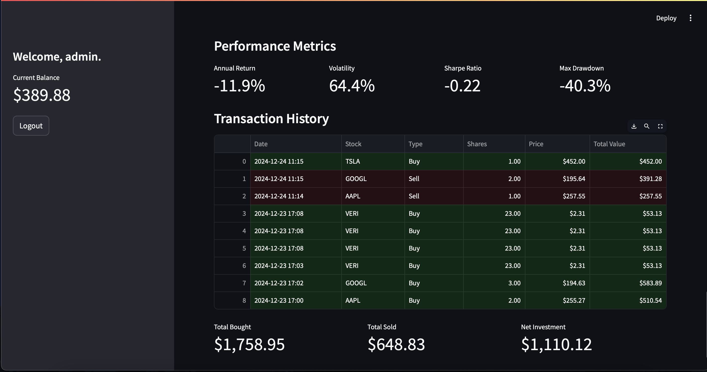

Welcome to the Stock Market Game! Check it out [here](https://stocks-game.streamlit.app).

Create a free account using any username and password and start trading! Stock prices are always up-to-date.

Enter a stock symbol. See the current price, the price history, the latest news, technical analysis including moving averages, volume analysis, returns distribution, and more. Check out the overall sentiment the market has over the stock (determined by analyzing the news) and see the articles used to determine that score. Of course, you can also buy and sell shares.

Then, we have your portfolio. See what stocks you currently own and their current value. Check out your distribution of stocks and your diversification score (and how you can improve it!). Check out the anlaytics of the stocks in your portfolio over time, the performance metrics, and your transaction history.

You can also check out the overall market. Read the news from different sectors, check out the market calendar and the overall market sentiment, analytics of trending stocks (the stocks themselves are currently static - will update this soon), an analysis of the market over different time ranges, and the performance of different sectors.

And finally, compete on the leaderboards! See how others are performing and how you need to perform to reach the next rank.

#### Screenshots

